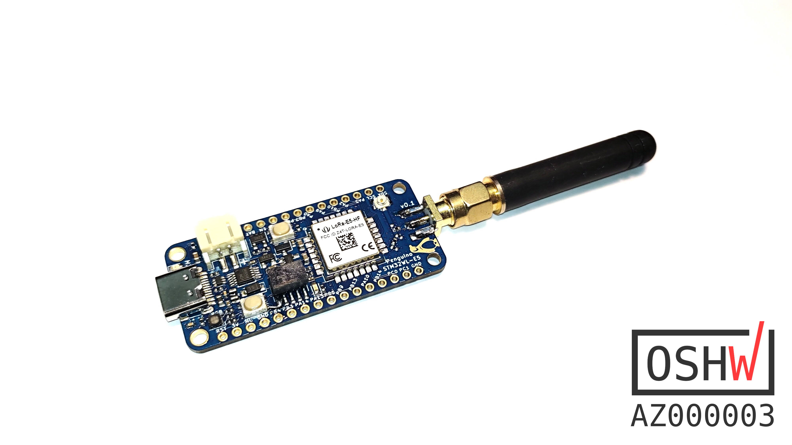
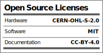

## Penguino-STM32WL-LoRa-E5
 Seeedstudio's [LoRa-E5 STM32WLE5JC](https://www.seeedstudio.com/LoRa-E5-Wireless-Module-p-4745.html) module was recently announced, and I took the liberty of designing a Penguino Feather breakout board for it. Hopefully OSHW community would benfit from it. 

## About the Penguino Feather breakout
Managed to fit everything on a +2 layer (H1.6mm) low-cost PCB. Careful design choices allowed to have a good GND plane on the back to to achieve good (theoretical) RF performance. 

_Current version: 0.1_

Board requirements are standard: 
- 6mil traces/clearance
- 0.3mm drill

### Specs (SoC): 
- [STM32WLE5JC](https://www.st.com/en/microcontrollers-microprocessors/stm32wle5jc.html) Wireless SoC
- ARM Cortex M4 ultra-low-power MCU
- Integrated SX1262 RF transciever
- Frequency range: 150 MHz to 960 MHz.
- Modulation: LoRa®, (G)FSK, (G)MSK and BPSK
- Transmitter power: programmable up to +22 dBm 

### Specs ([LoRa-E5 module](](https://www.seeedstudio.com/LoRa-E5-Wireless-Module-p-4745.html))): 
- Frequency range: EU868/US915/AU915/AS923/KR920/IN865 (high-band design). FCC and CE Certified
- Ultra-low Power Consumption: as low as 2.1uA sleep current (WOR mode)
- High Performance: TXOP=22dBm@868/915MHz; -136.5dBm sensitivity for SF12 with 125KHz BW 
- Long Distance Use: 158dB link budget
- Size: 12mm * 12mm * 2.5mm 28 pins SMT
- For further specs plese see the respective product pages. 

### License:
- Hardware license: CERN-OHL-S v2
- Software license: under MIT unless otherise indicated 
- Documentation license:  CC BY-SA 4.0 International.

## Open Source Hardware
This board is an OSHWA approved design: [AZ000003](https://certification.oshwa.org/az000003.html)

### Contact:
If you have any question or comments please feel free to open an issue (or a discussion or drop me a message at [@azerimaker](https://twitter.com/azerimaker). 
